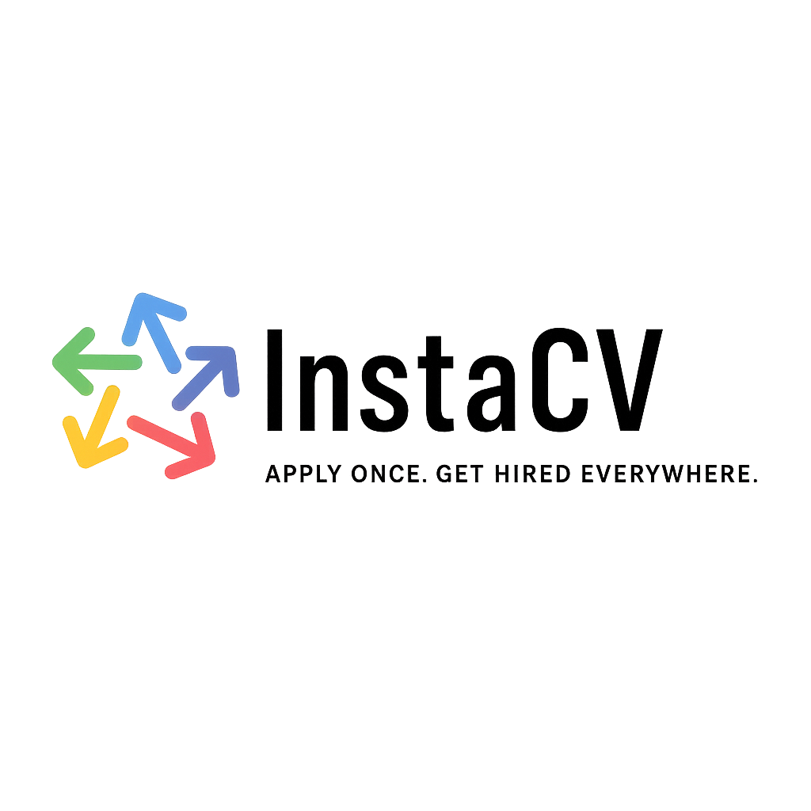

<div align="center">
  
  
  # Insta-CV Frontend
  
  **AI-Powered Resume Builder with Smart Job Matching**
  
  [](https://reactjs.org/)
  [](https://vitejs.dev/)
  [](https://tailwindcss.com/)
  [](LICENSE)

  [Live Demo](https://instacv-frontend-production.up.railway.app) · [Report Bug](https://github.com/agmad-team-graduation/Insta-CV-front/issues) · [Request Feature](https://github.com/agmad-team-graduation/Insta-CV-front/issues)
</div>

---

## 📋 Table of Contents

- [About the Project](#about-the-project)
- [Key Features](#key-features)
- [Tech Stack](#tech-stack)
- [Getting Started](#getting-started)
  - [Prerequisites](#prerequisites)
  - [Installation](#installation)
  - [Environment Configuration](#environment-configuration)
- [Usage](#usage)
- [Architecture](#architecture)
- [AI Integration](#ai-integration)
- [Deployment](#deployment)
- [Contributing](#contributing)
- [License](#license)
- [Contact](#contact)

---

## 🎯 About the Project

**Insta-CV** is a modern, AI-powered resume builder that helps developers and IT professionals create professional CVs, match with relevant jobs, and identify skill gaps. The platform leverages advanced NLP models for skill extraction, semantic matching, and intelligent job recommendations.

### What Makes Insta-CV Unique?

- **AI-Powered Skill Extraction**: Automatically extracts skills from job descriptions using fine-tuned transformer models
- **GitHub Integration**: Analyzes your repositories to automatically detect and suggest relevant skills
- **Smart Job Matching**: Semantic similarity matching between your skills and job requirements
- **Professional Templates**: 10+ ATS-friendly CV templates with pixel-perfect PDF export
- **Interview Preparation**: AI-generated interview questions based on job requirements

---

## ✨ Key Features

### 🎨 Resume Builder
- **Multiple Professional Templates**: Choose from 10+ modern, ATS-friendly designs
- **Real-time Preview**: WYSIWYG editor with instant visual feedback
- **Drag-and-Drop**: Reorder sections and customize layout effortlessly
- **PDF Export**: Pixel-perfect rendering using headless Chrome (Puppeteer)
- **Import Capabilities**: Import existing projects and experiences from GitHub

### 🤖 AI-Powered Features
- **Skill Extraction**: Fine-tuned JobBERT model extracts technical skills from job descriptions
- **Semantic Matching**: Uses sentence transformers (MiniLM-L6-v2) for intelligent skill comparison
- **Job Recommendations**: AI-driven job suggestions based on your profile
- **Skill Gap Analysis**: Identifies missing skills for target positions
- **Interview Questions**: LLM-generated questions tailored to job requirements

### 🔗 Integrations
- **GitHub OAuth**: Secure authentication and repository analysis
- **Google OAuth**: Alternative login method
- **Automatic Skill Detection**: Analyzes your GitHub repos to suggest relevant skills
- **Job Platform Integration**: Syncs with RemoteOK for latest developer positions

### 📊 Analytics & Insights
- **Compatibility Scores**: See how well you match with each job
- **Visual Progress Indicators**: Track your profile completion
- **Skill Coverage**: Understand which skills are in demand

---

## 🛠 Tech Stack

### Core Technologies
- **[React 19](https://reactjs.org/)** - Modern UI library with hooks and functional components
- **[Vite](https://vitejs.dev/)** - Lightning-fast build tool and dev server
- **[Tailwind CSS](https://tailwindcss.com/)** - Utility-first CSS framework
- **[TypeScript](https://www.typescriptlang.org/)** - Type-safe JavaScript

### UI Components & Libraries
- **[Shadcn/ui](https://ui.shadcn.com/)** - High-quality, accessible component library
- **[Radix UI](https://www.radix-ui.com/)** - Unstyled, accessible primitives
- **[Lucide React](https://lucide.dev/)** - Beautiful & consistent icon set
- **[Recharts](https://recharts.org/)** - Composable charting library

### State Management & Routing
- **[Zustand](https://zustand-demo.pmnd.rs/)** - Lightweight state management
- **[React Router](https://reactrouter.com/)** - Client-side routing
- **[React Hook Form](https://react-hook-form.com/)** - Performant form handling
- **[Zod](https://zod.dev/)** - Schema validation

### API & Data Fetching
- **[Axios](https://axios-http.com/)** - Promise-based HTTP client
- **JWT** - Secure authentication with automatic token refresh

### Development Tools
- **[ESLint](https://eslint.org/)** - Code linting
- **[Vite Plugin React](https://github.com/vitejs/vite-plugin-react)** - Fast Refresh with Babel

---

## 🚀 Getting Started

### Prerequisites

- **Node.js** >= 18.0.0
- **npm** >= 9.0.0 or **yarn** >= 1.22.0

### Installation

1. **Clone the repository**
   ```bash
   git clone https://github.com/agmad-team-graduation/Insta-CV-front.git
   cd Insta-CV-front
   ```

2. **Install dependencies**
   ```bash
   npm install
   ```

3. **Set up environment variables** (see [Environment Configuration](#environment-configuration))

4. **Start the development server**
   ```bash
   npm run dev
   ```

   The application will be available at `http://localhost:5173`

### Environment Configuration

Create a `.env` file in the root directory:

```env
# Backend API Configuration
VITE_API_BASE_URL=http://localhost:8080

# PDF Backend Configuration
VITE_PDF_BACKEND_URL=http://localhost:3001

# Frontend Base URL
VITE_FRONTEND_BASE_URL=http://localhost:5173

# App Version
VITE_VERSION=0.1.0-beta
```

#### Production Environment

For production deployment:

```env
VITE_API_BASE_URL=https://instacv-backend-production.up.railway.app
VITE_PDF_BACKEND_URL=https://your-pdf-service.railway.app
VITE_FRONTEND_BASE_URL=https://instacv-frontend-production.up.railway.app
VITE_VERSION=0.1.0-beta
```

**Note**: The PDF backend service must be deployed separately (see [PDF Generation Service](#pdf-generation-service))

---

## 💻 Usage

### Available Scripts

| Command | Description |
|---------|-------------|
| `npm run dev` | Start development server with hot reload |
| `npm run dev:prod` | Start dev server in production mode |
| `npm run build` | Build for production |
| `npm run preview` | Preview production build locally |
| `npm run lint` | Run ESLint to check code quality |

### Development Workflow

1. **Start the development server**
   ```bash
   npm run dev
   ```

2. **Access the application**
   - Frontend: `http://localhost:5173`
   - Ensure backend is running on `http://localhost:8080`
   - Ensure PDF service is running on `http://localhost:3001`

3. **Build for production**
   ```bash
   npm run build
   ```
   
   The optimized production build will be in the `dist/` directory.

4. **Preview production build**
   ```bash
   npm run preview
   ```

---

## 🏗 Architecture

The frontend follows a **feature-based architecture** organized around domain-specific functionality:

```
src/
├── common/              # Shared components, utilities, and styles
│   ├── components/     # Reusable UI components
│   │   └── ui/        # Shadcn/ui components
│   └── utils/         # Helper functions and API client
├── features/           # Domain-specific modules
│   ├── auth/          # Authentication and OAuth
│   ├── github/        # GitHub integration
│   ├── jobs/          # Job matching and recommendations
│   ├── profile/       # User profile management
│   └── resume-builder/ # CV creation and editing
├── dashboard/          # Main application interface
├── pages/             # Public pages (landing, about)
├── profile-flow/      # Onboarding wizard
├── store/             # Global state management (Zustand)
└── config.js          # Application configuration
```

### Key Design Principles

- **Modularity**: Features are self-contained and independent
- **Reusability**: Common components shared across features
- **Separation of Concerns**: Clear boundaries between UI, logic, and data
- **Accessibility**: WCAG-compliant components using Radix UI
- **Responsive Design**: Mobile-first approach with Tailwind CSS

---

## 🤖 AI Integration

### Skill Extraction Model

The platform uses **JobBERT**, a domain-adapted BERT model fine-tuned on the SkillSpan dataset for extracting technical skills and knowledge from job descriptions.

- **Model**: `jobbert_knowledge_extraction`
- **Task**: Named Entity Recognition (NER) with BIO tagging
- **F1 Score**: 0.612 (Precision: 0.558, Recall: 0.678)
- **Deployment**: FastAPI service on Hugging Face Spaces

### Semantic Skill Matching

Uses **sentence-transformers/all-MiniLM-L6-v2** for semantic similarity between user skills and job requirements.

- **Embedding Dimension**: 384
- **Similarity Metric**: Cosine similarity
- **Advantages**: Fast inference, lightweight (6-layer transformer), semantic understanding

### LLM Integration

- **Interview Questions**: `deepseek-r1-distill-llama-70b` via Groq
- **Job Summarization**: `meta-llama/llama-guard-4-12b` via Groq
- **PDF Parsing**: `Gemini Flash 2.5` via Google Vertex AI

---

## 🌐 Deployment

### Netlify Deployment

The application is configured for deployment on **Netlify** with automatic builds.

**Configuration** (`netlify.toml`):
```toml
[build]
  command = "npm run build"
  publish = "dist"

[[redirects]]
  from   = "/*"
  to     = "/index.html"
  status = 200
```

### PDF Generation Service

The PDF export functionality requires a separate **Puppeteer-based service**:

- **Technology**: Express.js + Puppeteer
- **Purpose**: Server-side rendering with headless Chrome
- **Deployment**: Railway or similar Node.js hosting
- **Repository**: [Contact for access]

This microservice ensures pixel-perfect PDF exports that match the on-screen preview and remain fully parsable by ATS systems.

### CI/CD

- **Automatic Deployments**: Push to `main` triggers production deployment
- **Preview Deployments**: Pull requests generate preview URLs
- **Environment Variables**: Configured in Netlify dashboard

---

## 🤝 Contributing

Contributions are welcome! Please follow these steps:

1. **Fork the repository**
2. **Create a feature branch**
   ```bash
   git checkout -b feature/AmazingFeature
   ```
3. **Commit your changes**
   ```bash
   git commit -m 'Add some AmazingFeature'
   ```
4. **Push to the branch**
   ```bash
   git push origin feature/AmazingFeature
   ```
5. **Open a Pull Request**

### Code Style

- Follow existing code conventions
- Use ESLint for linting: `npm run lint`
- Write meaningful commit messages
- Add comments for complex logic

---

## 📄 License

This project is licensed under the **MIT License** - see the [LICENSE](LICENSE) file for details.

---

## 👥 Contact

**AGMAD Team** - Graduation Project

- **Repository**: [github.com/agmad-team-graduation/Insta-CV-front](https://github.com/agmad-team-graduation/Insta-CV-front)
- **Issues**: [Submit an issue](https://github.com/agmad-team-graduation/Insta-CV-front/issues)

---

## 🙏 Acknowledgments

- **SkillSpan Paper**: Foundation for skill extraction methodology
- **Shadcn/ui**: Beautiful component library
- **Radix UI**: Accessible component primitives
- **Hugging Face**: Model hosting infrastructure
- **Railway & Netlify**: Deployment platforms

---

<div align="center">
  Made with ❤️ by the AGMAD Team
</div>
